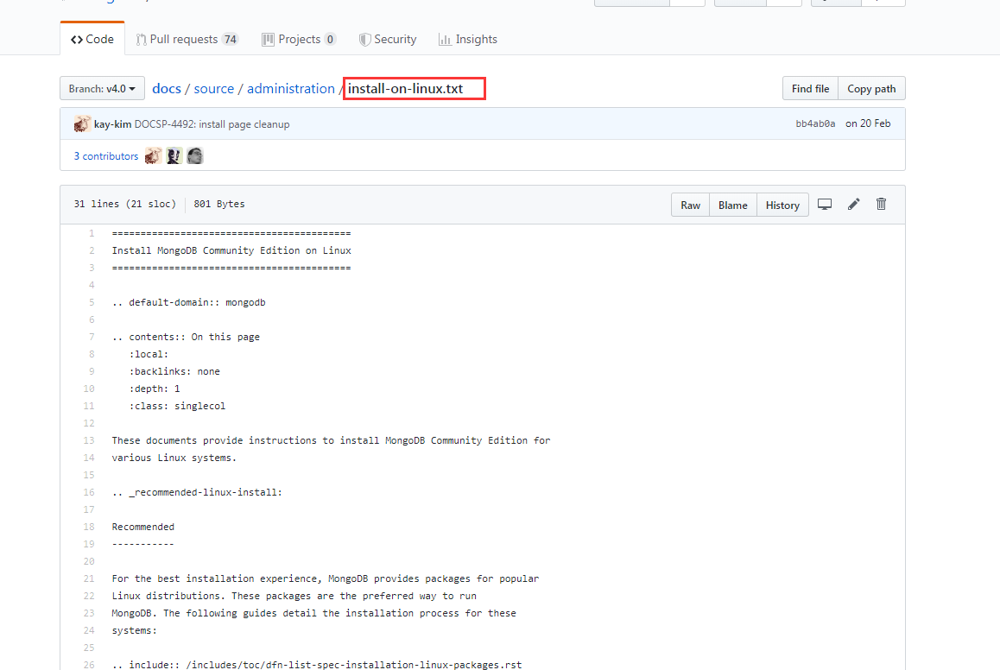

# 基于VuePress 定制化MongoDB theme的MongoDB docs 官方重构(MongoDB doc中文文档)

## 预计6个月-12个月的时间完成本项目TODO...ING

## 主题特性

- 支持多级sidebar嵌套。（MongoDB sidebar有大量的且嵌套很深的dropdown）
- 定制化UI
- 支持I18
- 社区支持
- Markdown支持（[这也是这个项目的诞生原因](#关于本项目)）
- SEO
- 轻便
- Vue

## 关于本项目

### 原因：

- txt书写。原官方的用txt文件上书写
- 脚本转换。加上python、ruby脚本抓换
- 强迫症。这以上，让博主蛋疼，决定基于VuePress重构MongoDB官网原站，并翻译zh-CN。

### 整站资源：

- 单语言有1100+markdown个文件

- author:[@veaba](https://github.com/veaba)
